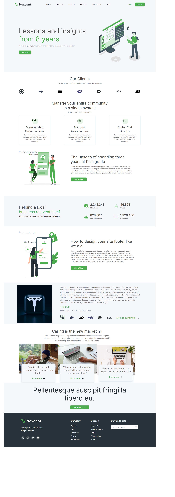

# Figma Design Link

Link - https://www.figma.com/design/UOoMcZFLX6WsH3x936SjWM/Responsive-Landing-Page-Design-%7C-Website-Home-Page-Design-%7C-Agency-Website-UI-Design--Community-?node-id=5-573&t=lPQQ9xpSiwIiPkAp-1

## Getting started

> **Prerequisites:**
> The following steps require [NodeJS](https://nodejs.org/en/) to be installed on your system, so please
> install it beforehand if you haven't already.

To get started with your project, you'll first need to install the dependencies with:

```
npm install
```

Then, you'll be able to run a development version of the project with:

```
npm run dev
```

After a few seconds, your project should be accessible at the address
[http://localhost:5173/](http://localhost:5173/)


If you are satisfied with the result, you can finally build the project for release with:

```
npm run build
```
# Screen shot

